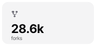
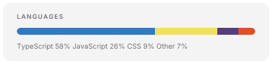
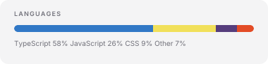
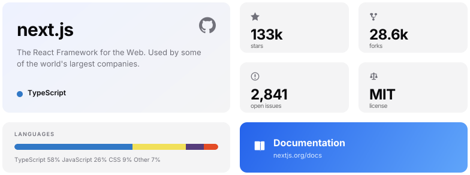

# bento-render-spike

Throwaway test repo. Each section below renders the **same bento grid** a different way,
to find out what GitHub's markdown sanitizer and CSS actually do to it.

Questions being answered:

1. Do `colspan` / `rowspan` survive sanitization?
2. Do gutters baked into the image as transparent padding read correctly, or does
   GitHub's table CSS add its own borders and spacing?
3. Do `cellspacing` / `cellpadding` survive, and do they beat baked-in gutters?
4. Does `<picture>` + `prefers-color-scheme` switch themes inside a README?
5. Does per-tile linking work (each tile its own `<a>`)?

---

## A — table, gutter baked into each image

Each tile PNG carries 4px of transparent padding on every edge, so adjacent tiles
should appear to have an 8px gutter with no CSS involved. Every tile is its own link.

<table>
  <tr>
    <td colspan="2" rowspan="2">
      
    </td>
    <td>
      
    </td>
    <td>
      
    </td>
  </tr>
  <tr>
    <td>
      
    </td>
    <td>
      
    </td>
  </tr>
  <tr>
    <td colspan="2">
      
    </td>
    <td colspan="2">
      
    </td>
  </tr>
</table>

---

## B — table, flush tiles, no gutter anywhere

Same layout, but the images have **no** transparent padding. Whatever space appears
between tiles here is GitHub's own table CSS, not ours.

<table>
  <tr>
    <td colspan="2" rowspan="2">
      
    </td>
    <td>
      
    </td>
    <td>
      
    </td>
  </tr>
  <tr>
    <td>
      
    </td>
    <td>
      
    </td>
  </tr>
  <tr>
    <td colspan="2">
      
    </td>
    <td colspan="2">
      
    </td>
  </tr>
</table>

---

## C — table, flush tiles, gutter from cellspacing/cellpadding

Flush images again, but asking the table for the gap. Tests whether these attributes
survive the sanitizer and whether GitHub's stylesheet overrides them.

<table cellspacing="8" cellpadding="0" border="0">
  <tr>
    <td colspan="2" rowspan="2">
      
    </td>
    <td>
      
    </td>
    <td>
      
    </td>
  </tr>
  <tr>
    <td>
      
    </td>
    <td>
      
    </td>
  </tr>
  <tr>
    <td colspan="2">
      
    </td>
    <td colspan="2">
      
    </td>
  </tr>
</table>

---

## D — dark mode via `<picture>`

Same grid as A, but each tile ships light and dark variants. **Switch your GitHub theme
to see whether these follow.**

<table>
  <tr>
    <td colspan="2" rowspan="2">
      <a href="https://github.com/vercel/next.js">
        <picture>
          <source media="(prefers-color-scheme: dark)" srcset="img/hero-dark.png" />
          
        </picture>
      </a>
    </td>
    <td>
      <a href="https://github.com/vercel/next.js/stargazers">
        <picture>
          <source media="(prefers-color-scheme: dark)" srcset="img/stars-dark.png" />
          
        </picture>
      </a>
    </td>
    <td>
      <a href="https://github.com/vercel/next.js/forks">
        <picture>
          <source media="(prefers-color-scheme: dark)" srcset="img/forks-dark.png" />
          
        </picture>
      </a>
    </td>
  </tr>
  <tr>
    <td>
      <a href="https://github.com/vercel/next.js/issues">
        <picture>
          <source media="(prefers-color-scheme: dark)" srcset="img/issues-dark.png" />
          
        </picture>
      </a>
    </td>
    <td>
      <a href="https://github.com/vercel/next.js/blob/canary/license.md">
        <picture>
          <source media="(prefers-color-scheme: dark)" srcset="img/license-dark.png" />
          
        </picture>
      </a>
    </td>
  </tr>
  <tr>
    <td colspan="2">
      <a href="https://github.com/vercel/next.js">
        <picture>
          <source media="(prefers-color-scheme: dark)" srcset="img/langs-dark.png" />
          
        </picture>
      </a>
    </td>
    <td colspan="2">
      <a href="https://nextjs.org/docs">
        <picture>
          <source media="(prefers-color-scheme: dark)" srcset="img/docs-dark.png" />
          
        </picture>
      </a>
    </td>
  </tr>
</table>

---

## E — Mode A, the whole frame as one image

One image, one link, no table at all. This is the layout the grid is *supposed* to
match, so it doubles as the reference for how A/B/C should look.

### E2 — Mode A with dark mode

<a href="https://github.com/vercel/next.js">
  <picture>
    <source media="(prefers-color-scheme: dark)" srcset="img/frame-dark.png" />
    
  </picture>
</a>

---

## F — plain markdown baseline

No HTML at all. Cannot carry a link; included only to confirm the images themselves are fine.

---

## G — NO TABLE: strips of inline linked images

**This is the important one.** GitHub's CSS puts `border: 1px solid` and `padding: 6px 13px`
on every `<td>`, and zebra-stripes even rows. Images *outside* a table get none of that
(`.markdown-body img { box-sizing: content-box; max-width: 100% }` only).

So: slice the design into horizontal strips, and lay each strip out as inline ``
with **no whitespace between the tags**. Every tile still gets its own link.

### G1 — no whitespace between tags

### G2 — same, but with newlines between the tags

If this shows extra horizontal gaps, whitespace between inline images is significant and
the generator must emit G1's format exactly.

---

## H — strips + dark mode

<a href="https://github.com/vercel/next.js"><picture><source media="(prefers-color-scheme: dark)" srcset="img/langs-dark.png" /></picture></a><a href="https://nextjs.org/docs"><picture><source media="(prefers-color-scheme: dark)" srcset="img/docs-dark.png" /></picture></a>

<a href="https://github.com/vercel/next.js/stargazers"><picture><source media="(prefers-color-scheme: dark)" srcset="img/stars-dark.png" /></picture></a><a href="https://github.com/vercel/next.js/forks"><picture><source media="(prefers-color-scheme: dark)" srcset="img/forks-dark.png" /></picture></a><a href="https://github.com/vercel/next.js/issues"><picture><source media="(prefers-color-scheme: dark)" srcset="img/issues-dark.png" /></picture></a><a href="https://github.com/vercel/next.js/blob/canary/license.md"><picture><source media="(prefers-color-scheme: dark)" srcset="img/license-dark.png" /></picture></a>

---

## What to look for

| Variant | Expect |
|---|---|
| A / B / C | 1px borders around every tile, extra padding, zebra-striped row 2 |
| C | does `cellspacing` change anything, or does CSS `padding` win? |
| D | tiles follow the GitHub theme toggle |
| E / E2 | clean bento, one link only — the look we want |
| **G1** | **clean bento, no borders, per-tile links — the look we want AND links** |
| G2 | same but with gaps if inline whitespace is significant |
| H | G1 plus theme switching |
